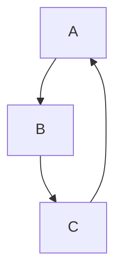
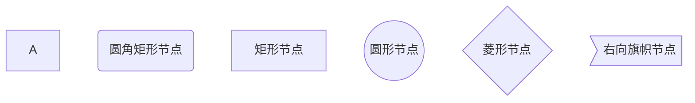

[toc]

#### 文字

##### 删除线：~~ + ~~

这就是 	~~删除线~~

##### 斜体：* + *

*斜体*

##### 加粗：** + **

**加粗**

##### 下划线：快捷键：Ctrl + U

<u>文字</u>

##### 高亮： == 文字 ==

==文字==

##### 下标：~ + ~

水：H~2~O

##### 上标：^ + ^

面积：m^2^

##### 表情符号：: + 单词 +

:smile:

#### 引用: > +内容

> 引用

#### 分割线：*** 或 ---

***


#### 有序列表

* 编号 + . 创建编号，Tab键创建下一级标题。快捷键: `Ctrl +Shift + [`

1. 打开冰箱
   1. 插电
   2. 开机
   3. 开门

2. 把大象放进冰箱

3. 关闭冰箱

#### 无序列表

*或者-后一定要有空格。快捷键：`Ctrl + Shift + ]`

- 青菜
- 水果
  1. 苹果
  2. 梨子
  3. 菠萝
     - 国产菠萝
     - 进口菠萝
- 肉

#### 任务列表

* -[]每个符号后面都要有空格键，没有快捷键，

- [x] 引导学生审视笔记的价值
- [x] 讲解笔记的正确定位
- [ ] 笔记工具的选择

#### 表格

- 创建方式：|学号|姓名|性别| 。注意：添加一行 `Ctrl+Enter`。快捷键：`Ctrl+T`

| 学号 | 姓名 | 性别 | 年龄 |
| :--- | ---- | ---- | ---- |
| 001  | 张三 | 男   | 22   |
| 002  | 李四 | 男   | 21   |
| 003  | 王五 | 男   | 22   |

#### 行内代码

包住行内代码。快捷键：Ctrl + Shift +` 

`Java`是一门面向对象编程语言，不仅吸收了`C++`语言的各种优点，还摒弃了`C++`里难以理解的指针等概念

#### 代码块

* 创建方式：```语言 或 ~~~语言。快捷键：Ctrl + Shift + K

```python
def func():
    a = list()
    a.append(b)
```

#### 插入图片

* 创建方式：! + [name] + (address) 。快捷键：Ctrl + Shift + I


#### 跳转

##### 外部跳转：[链接文本]（link)

[帮助文档](https://www.jianshu.com/p/7944aab87102)

##### 内部跳转：[链接文本]（# 标题）

[文字](# 文字)

#### 自动连接

- <>包括的url或者email地址会自动转换为超链接

<https://www.baidu.com>

#### 流程图

##### 概述

```
graph 方向描述
	图表中其他语句
```

关键字`graph`表示一个流程图的开始，同时需要定义该图的方向。

其中“方向描述”为：

| 用词 | 含义     |
| ---- | -------- |
| TB   | 从上到下 |
| BT   | 从下到上 |
| RL   | 从右到左 |
| LR   | 从左到右 |



##### 流程图常用符号及含义

###### 节点形状

| 表述       | 说明         | 含义                                                 |
| ---------- | ------------ | ---------------------------------------------------- |
| id[文字]   | 矩形节点     | 表示过程，也就是流程中的一个环节                     |
| id(文字)   | 圆角矩形节点 | 表示开始和结束                                       |
| id((文字)) | 圆形节点     | 表示连接，为避免流程过长或有交叉，可将流程切开、成对 |
| id{文字}   | 菱形节点     | 表示判断、决策                                       |
| id>文字]   | 右向旗帜节点 |                                                      |



```mermaid


	
```


